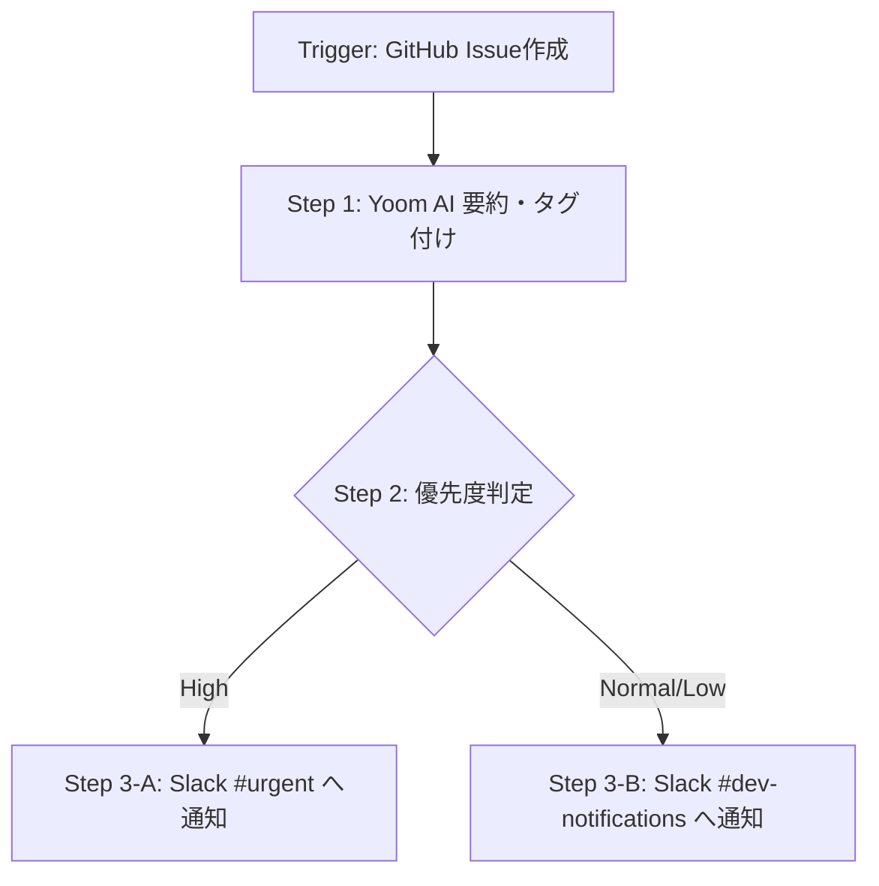

# 【フローボットID/管理番号】フローボット名称

## 1. 基本情報 (Overview)

| 項目 | 内容 |
| :--- | :--- |
| **フロー名** | [例] GitHub Issue作成時のSlack自動通知 |
| **管理番号 / ID** | FLOW-001 |
| **Yoom管理URL** | `https://app.yoom.fun/bots/xxxxxxx` |
| **ステータス** | 🟡 開発中 / 🟢 本番運用中 / ⚪ 停止中 / 🔴 廃止 |
| **所有者 / 管理者** | 山田 太郎 (開発チーム) |
| **最終更新日** | 2026-09-15 |

---

## 2. 目的と概要 (Purpose & Description)

* **ビジネス目的:**  
  [例] 開発メンバーへの要対応Issueの通知漏れを防ぎ、Initial Responseまでの時間を短縮する。
* **処理の概要:**  
  [例] GitHubで新しいIssueが作成されたら、YoomのAI機能で難易度と分類を自動判定し、指定のSlackチャンネルへ通知を送信する。

---

## 3. 動作条件・連携アカウント (Triggers & Integrations)

### 3.1 連携アカウント (Connected Accounts)
* **GitHub:** `DevOps-Service-Account`
* **Slack:** `Slack-Bot-Integration`
* **OpenAI / Yoom AI:** (組み込みAI機能を利用)

### 3.2 起動トリガー (Trigger Events)
* **アプリ:** GitHub
* **イベント:** 新しいIssueが作成されたら
* **スケジュール / 実行間隔:** 即時実行 (Webhook)

---

## 4. フロー詳細構成 (Flow Steps & Data Flow)



### ステップ詳細

#### 🔹 Trigger: GitHub Issue作成
* **設定パラメータ:**
  * Repository: `organization/main-repo`
  * State: `Open`
* **取得する主な変数 (Variables):**
  * `{{issue.title}}`: Issueのタイトル
  * `{{issue.body}}`: Issueの本文
  * `{{issue.user.login}}`: 作成者名
  * `{{issue.html_url}}`: IssueのURL

---

#### 🔹 Step 1: AI要約・緊急度判定 (Yoom AI)
* **アクション:** テキスト生成 / 要約
* **プロンプト / 設定入力:**
  > 以下のIssue内容を要約し、緊急度を「High」「Normal」「Low」のいずれかで判定してください。
  > タイトル: `{{issue.title}}`
  > 本文: `{{issue.body}}`
* **出力変数 (Outputs):**
  * `{{step1.summary}}`: 要約テキスト
  * `{{step1.priority}}`: 判定された優先度

---

#### 🔹 Step 2: 条件分岐 (Branching)
* **分岐条件:**
  * 条件A: `{{step1.priority}}` 等しい `High` ➔ **Step 3-A** へ
  * 条件B: 上記以外 ➔ **Step 3-B** へ

---

#### 🔹 Step 3-A: Slack通知 (緊急)
* **対象:** Slack `#urgent-alert`
* **送信メッセージ:**
  ```text
  🚨 【緊急Issue通知】
  タイトル: {{issue.title}}
  作成者: {{issue.user.login}}
  要約: {{step1.summary}}
  URL: {{issue.html_url}}
  ```

---

## 5. エラーハンドリング・例外処理 (Exception Handling)

* **エラー時の通知先:** 運用チームメール (`ops-alert@example.com`) / Slack `#yoom-system-log`
* **リカバリ手順:**  
  1. API制限等で失敗した場合は、Yoom管理画面の「実行履歴」から該当ログを確認。
  2. 原因解決後、実行履歴詳細の「再実行」ボタンを押下する。

---

## 6. バージョン変更履歴 (Changelog)

| バージョン | 変更年月日 | 変更者 | 変更内容・理由 | PR / Issueリンク |
| :--- | :--- | :--- | :--- | :--- |
| **v1.1.0** | 2026-09-15 | 佐藤 花子 | AIによる自動要約ステップ (Step 1) を追加 | `#PR-102` |
| **v1.0.1** | 2026-08-20 | 山田 太郎 | Slackの通知先チャンネルを `#general` から `#dev` へ変更 | `#PR-45` |
| **v1.0.0** | 2026-08-01 | 山田 太郎 | 新規作成・本番運用開始 | `#PR-12` |
